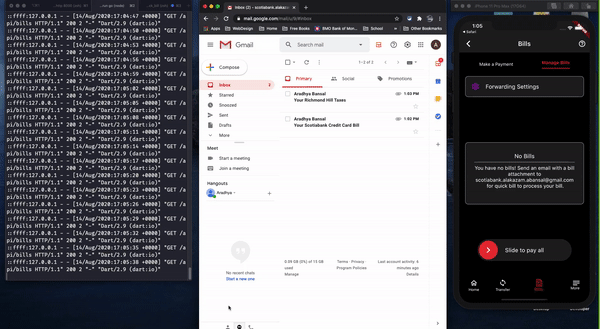
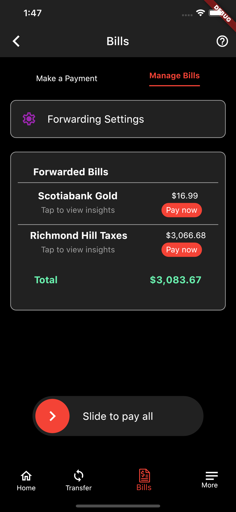

# QuickBill
Built for S:Hacks 2020

## Description
QuickBill is our solution to disrupt the traditional process of bill payments, by providing the payments services of a branch in the palm of your hand. We harnessed the power of machine learning optical and image recognition to provide a bill payment solution that is as easy as it can be! You can forward your bills via email to the QuickBill Scotiabank Inbox for processing, or you can take a picture of the bill within the app as well! It's that easy- leave the account number, due date, and payee finding to us. You can check out our design mockups in Figma [here](https://www.figma.com/proto/okoDeV5sWxdPqelHvZaTmT/Scotia-Hacks?node-id=5%3A106&scaling=min-zoom).

## Tech Used
- TypeScript
- Node.js
- MongoDB
- Flutter/Dart
- Google Cloud Vision
- Optical Image Recognition

## Demo

## Mobile App Screenshot

